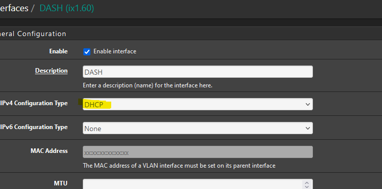

# DDPAI Downloader
[](https://choosealicense.com/licenses/mit/)  
I own an DDPAI Mini 5 camera. Which comes with an app and can be able to connect using WIFI. I have my camera plugged into a constant power source and this gave me the idea to download footage using my K3S cluster when car is parked in the garage. This simple project just downloads camera footage when it sees the camera in the network. 

Special thanks go to author of https://www.eionix.co.in/2019/10/10/reverse-engineer-ddpai-firmware.html

# Features
- [x] Download Recordings
- [x] Download Events
- [x] Rotating History
- [ ] HTTP Health status
- [ ] Delete Events after downloading

# How to get started
## Power
You need constant power to your camera. This will allow your system to connect to the camera when you park the car and walks away. I recommend a commercially made [Dash cam battery packs](https://www.blackboxmycar.com/collections/battery-packs). Do not connect your camera to your car battery. This will ruin your battery one day and will get you stranded if you forget to start the car every day.

## Networking
This is the biggest hurdle. You need to be able to connect to the camera using wifi to download. Camera runs a DHCP server and advertises the AP. This project simply looks for 193.168.0.1(camera) in the network to make requests to download.
Other thing to note is camera has an 5ghz radio, this makes it faster to download. However, this bring an interesting problem of finding a cheap solution to connect to the camera.

We need solve two issues:
* Need 5ghz capable radio with being able to connect to the camera automatically.
* DDAPI camera (At least on mini5) is on a public ip range. This is an issue if you try to connect to the camera. Router not going route the traffic properly.

### My Solution:

* For the wifi radio I went with [Mikrotik SXTsq 5](https://mikrotik.com/product/sxtsq_5_high_power). Readily available and cheap. Only issue is, AP only connect at 100mbs and seems like camera can easily saturate the link. If you find a better radio for this application, let me know. 

1) Give AP a static IP in the range of 193.168.0.x/24
2) Set a bridge between Ethernet and WLAN

3) Set the security key for the camera and connect to the camera


This should let you connect to the camera network through the access point ethernet port.

* For networking, I ended up connecting the radio to a my pfsense router and treat the AP as a gateway. Then I redirected any requests that goes to 193.168.0.1 into the correct gateway. I'm sure there are other ways to do this but I found this to be reliable. Since the camera is on a public ip range, it was easy to make a pfsense firewall rule to redirect. DO NOT CONNECT THE ACCESS POINT TO YOUR NORMAL NETWORK, UNLESS YOU RUN IT THROUGH A VLAN! Having two dhcp servers in your home network will cause issues.
1) Set a new interface in pfsense and DHCP as he IPv4 config type. If everything is connected correctly, you should see pfsense getting an IP from the camera.

2) Create a gateway so that we can forward the traffic to it.

2) Go to firewall rules and have your local rules forward any request to destination 193.168.0.1 into the new gateway you created. This will force your router to forward the traffic to the camera network instead of the internet since 193.168.0.X is in public ip range.


Now you should be able to use your browser to to hit this link [http://193.168.0.1/vcam/cmd.cgi?cmd=API_EquipGetTime](http://193.168.0.1/vcam/cmd.cgi?cmd=API_EquipGetTime) and you should get a respond back from the camera. If you are having issues check Mikrotik wlan status for the link. Then check pfsense firewall logs for any errors.

### Alternative Solutions

1) Connect to the camera using a WIFI dongle using your server/computer.
2) Use a Raspberry Pi to connect.

## Running the application
Example:
```
docker run --rm -d -v /path/on/host:/mnt/dvr/ --name="ddpai_downloader" -e STORAGE_PATH=/mnt/dvr/ -e RECORDING_HISTORY=96h ghcr.io/hansaya/ddpai_downloader:main
```
You can modify the existing configuration using these env variables

| Name          | Default       | Description  |
| ------------- |:-------------:| :-----------:|
| HTTP_PORT     | 8080          | HTTP health Status. Used for k3s |
| STORAGE_PATH  | ${PWD}        | Location to store the recordings |
| CAM_URL       | http://193.168.0.1 | Camera URL |
| INTERVAL      | 30s           | Wait period between each camera ping |
| TIMEOUT       | 120s          | Download timeout. This will make the application quit downloading if it takes too long |
| RECORDING_HISTORY | 96h       | Length of recording history to keep |
| LOG_LEVEL     | info          | Log level |